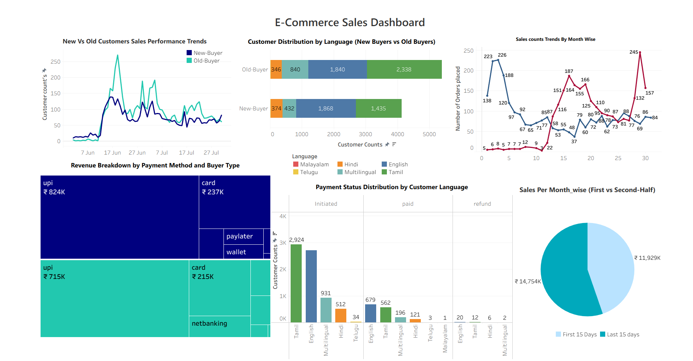

# 📊 **E-Commerce Sales Analysis — Power BI & Tableau Dashboards**  
### *Comprehensive End-to-End Data Analytics Project (Power BI & Tableau)(June–July 2022)*

---

## 🧾 **1. Introduction**

E-commerce businesses generate large volumes of transactional data daily.  
This project analyzes **two months of E-Commerce sales data (June–July 2022)** using **Excel, Power BI, and Tableau** to uncover insights related to:

- Sales performance  
- Customer behaviour  
- Payment method preferences  
- Coupon effectiveness  
- Buyer segmentation  
- Product-wise revenue  

The goal was to convert raw data into clear business intelligence dashboards that support **strategic decision-making**.

---

## 🎯 **2. Project Objectives**

1. Clean, preprocess, and enhance raw sales data using Excel  
2. Build **Power BI** dashboards focusing on KPIs, revenue, and sales patterns  
3. Build **Tableau** dashboards focused on customer segmentation  
4. Analyze customer behaviour such as: daily/weekly trends, coupon use, payment modes  
5. Build dynamic and interactive dashboards for business insights  
6. Extract key findings to support marketing, operations, and sales strategy  

---

## 📁 **3. Dataset Overview**

**Total Records:** 9,513 transactions (June–July 2022)  
**Data Preparation Performed in Excel **

### Key Columns:
- User ID  
- Product Code  
- Payment Mode  
- Payment Status  
- Coupon Status  
- Lead Registered Date  
- Sales Date  
- User Status (New-Buyer, Old-Buyer)  
- Product Amount (INR/USD)  
- Transaction Bank  
- Day Intervals  
- Language  
- Sales Day  
- Month Number  
- First-Half / Last-Half  

### Preprocessing Steps:
- Removed nulls and cleaned inconsistent labels  
- Added new calculated columns (Day intervals, First/Last 15 Days, etc.)  
- Fixed date formats  
- Extracted additional features from dates  
- Loaded cleaned dataset into Power bi 
- Used processed dataset for Power BI and Tableau dashboards  

---

# 📊 **4. Power BI Dashboard — Visuals & Insights**

> [E-Commerce Sales PowerBI Dashboard](E-commerce Sales Analysis Powerbi Dashboard.png)

---

## **4.1 Key Insights from Power BI Visuals**

### 🟩 **KPI Cards**
- **Total Orders:** 9,513  
- **Total Revenue:** ₹26.7M  
- **Average Revenue Per Order:** ₹2,805  
- **Total Buyers:** 5,884  
- **Product Count:** 141  

**Insight:** Strong customer activity with nearly 6K buyers and consistent sales volume.

---

### 📈 **Monthly Sales Revenue Trend**
- Highest revenue days:  
  - **July 4** → ₹1.93M (277 sales)  
  - **July 22** → ₹0.33M  
- Lowest revenue: **June 1–12**

**Insight:** July shows stronger sales momentum compared to June.

---

### 📊 **Weekly Order Distribution**
- Fridays (especially in July) produced the **highest order volume**  
- Weekends also show strong growth  

**Insight:** Customers purchase more during weekends and Fridays.

---

### 🏷️ **Top 5 Product Sales**
**Insight:**  
- Product1 leads revenue and purchase frequency  
- Coupon-based purchases produce lower revenue per transaction  

---

### 🎟️ **Coupon Usage Performance**
**Insight:**  
- Coupon1 has the highest revenue contribution  
- Low engagement for most coupons indicates discount fatigue or irrelevance  

---

### 🌎 **Language Preference**
**Insight:**  
- English (42.7%) & Tamil (37%) dominate customer base  
- Represents a bilingual-heavy audience  

---

### 💳 **Payment Mode Breakdown**
**Insight:**  
- **UPI contributes the highest revenue (~₹1.5M)**  
- Card and wallet use remain secondary  

---

### 🚀 **Customer Journey (Lead → Purchase Time)**
**Insight:**  
- Majority of customers convert **same-day**  
- Very small percentage convert after 10+ days  

---

### 🏦 **Top Banks for Customer Payments**
**Insight:**  
- **HDFC & SBI** handle most payments, each above **25K+ transactions**  

---

## **4.2 Power BI Summary**

The Power BI dashboard delivers strong insights on:

- Revenue fluctuations  
- Customer buying frequency  
- Coupon patterns  
- Payment behaviour  
- Bank performance  

Perfect for revenue optimization and marketing strategy planning.

---

# 📊 **5. Tableau Dashboard — Visuals & Insights**

---

## **5.1 Key Insights from Tableau Visuals**

### 📈 **New vs Old Customer Trends**
**Insight:**  
- Old buyers consistently outperform new buyers  
- Strong loyalty spikes during mid-June & mid-July  

---

### 🌍 **Customer Distribution by Language**
**Insight:**  
- Tamil & English dominate purchases  
- Old buyers lead across all languages  

---

### 💳 **Revenue Breakdown by Payment Mode & Buyer Type**
**Insight:**  
- UPI generates highest revenue for both buyer segments  
- Old buyers spend more per transaction  

---

### 📋 **Payment Status by Language**
**Insight:**  
- English + Tamil users have the highest successful payments  
- Refund cases are minimal  

---

### 🥧 **First vs Last 15 Days (Half-Month Revenue)**
- First 15 Days: **₹14.75M**  
- Last 15 Days: **₹11.92M**

**Insight:**  
Revenue is higher in the first half of the month → salary-cycle effect.

---

## **5.2 Tableau Summary**

The Tableau dashboard provides deeper behavioural insights:
- Buyer segmentation  
- Payment behaviour  
- Monthly spending patterns  
- Language-driven behaviour  

Ideal for customer experience and retention teams.

---

# 🏁 **6. Summary & Conclusion**

This project demonstrates an end-to-end analytics workflow using:

- **Excel** → Data cleaning  
- **SQL** → Data validation  
- **Power BI** → Revenue & operational analytics  
- **Tableau** → Segmentation & customer behaviour analytics  

### 🔥 Key Findings:
- July outperforms June in revenue  
- Fridays and weekends bring highest order volume  
- UPI dominates payment methods  
- Coupons lower revenue but boost volume  
- Old buyers contribute more total revenue  
- Core audience: English + Tamil  
- Most customers convert same-day  

### 🎯 Business Recommendations:
- Run promotions on Fridays & first half of month  
- Target old buyers with loyalty rewards  
- Strengthen UPI infrastructure  
- Improve multilingual marketing  

---

## 📌 Author  
**Yogeshwaran N**  
Data Analyst | BI Developer  
